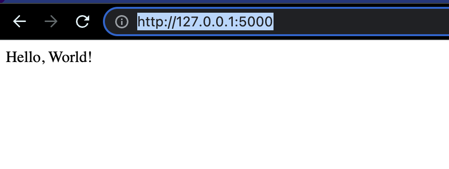

# Using flask

You can implement a simple web end point by using flask.

```bash
class MyFlaskApp:
    def __init__(self, name):
        self.app = Flask(name)

    def run(self):
        @self.app.route('/')
        def index():
            return "Hello, World!"
        self.app.run()
```

Running on console

```bash
> python3 sample5.py
 * Serving Flask app 'sample5'
 * Debug mode: off
WARNING: This is a development server. Do not use it in a production deployment. Use a production WSGI server instead.
 * Running on http://127.0.0.1:5000
Press CTRL+C to quit
127.0.0.1 - - [07/Feb/2023 13:30:18] "GET / HTTP/1.1" 200 -
127.0.0.1 - - [07/Feb/2023 13:30:18] "GET /favicon.ico HTTP/1.1" 404 -
```

